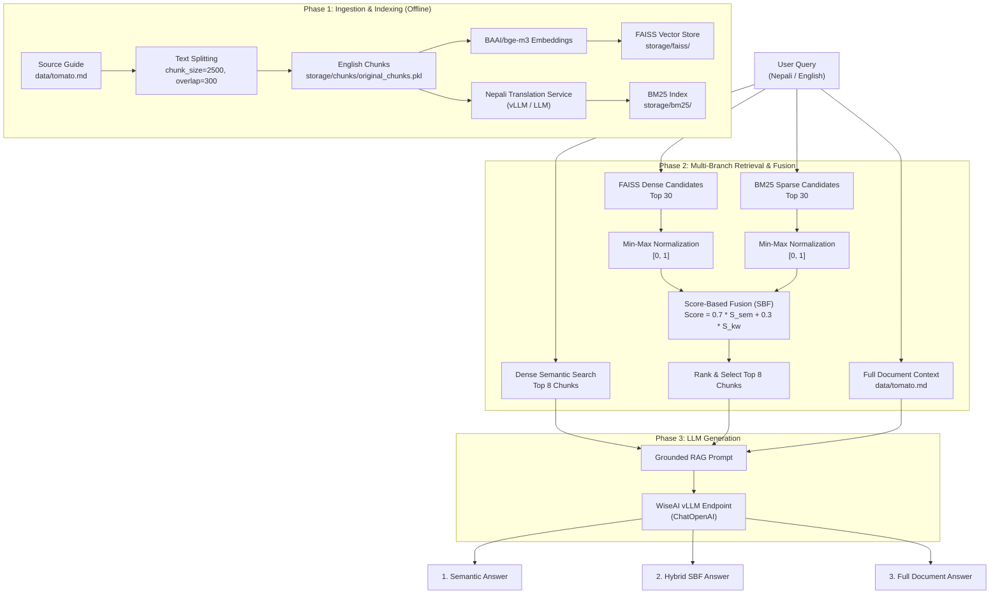

# Cross-Lingual Hybrid RAG Pipeline for Agricultural QA

A production-ready **Cross-Lingual Hybrid Retrieval-Augmented Generation (RAG)** system designed for agricultural question-answering in **Nepali** and **English** (focused on tomato cultivation).

The pipeline combines multilingual dense semantic retrieval with cross-lingual sparse keyword retrieval (BM25), fuses them using **Score-Based Fusion (SBF)** with Min-Max normalization, and generates grounded answers through an OpenAI-compatible **vLLM** inference server.

---

## 📑 Table of Contents

- [Key Features](#-key-features)
- [System Architecture](#-system-architecture)
  - [End-to-End Workflow](#end-to-end-workflow)
  - [Score-Based Fusion (SBF) Formulation](#score-based-fusion-sbf-formulation)
- [Project Directory Structure](#-project-directory-structure)
- [Prerequisites](#-prerequisites)
- [Installation & Setup](#-installation--setup)
- [Data Ingestion & Indexing](#-data-ingestion--indexing)
- [Running the FastAPI Application](#-running-the-fastapi-application)
  - [API Endpoints](#api-endpoints)
  - [Sample API Request & Response](#sample-api-request--response)
- [Evaluation & Benchmarking](#-evaluation--benchmarking)
- [Testing & Diagnostics](#-testing--diagnostics)
- [Configuration & Hyperparameter Tuning](#-configuration--hyperparameter-tuning)
- [License](#-license)

---

## 🌟 Key Features

1. **Cross-Lingual Knowledge Retrieval**:
   - Source agronomy knowledge is maintained in English (`data/tomato.md`).
   - English chunks are translated into Nepali and indexed with BM25 to eliminate the cross-lingual vocabulary gap for native Devanagari queries.
2. **Dense Vector Search**:
   - Vectorized using `BAAI/bge-m3` (multilingual dense embeddings, 1024 dimensions) and indexed using FAISS.
3. **Score-Based Fusion (SBF)**:
   - Fetches candidate pools from both dense FAISS and sparse BM25 indices.
   - Normalizes heterogeneous scores using Min-Max scaling to $[0, 1]$.
   - Fuses ranks with tunable weighting ($\alpha = 0.7$ semantic, $1 - \alpha = 0.3$ keyword).
4. **Comparative Multi-Branch Generation**:
   - Generates and returns answers from:
     1. **Semantic RAG** (pure FAISS dense retrieval)
     2. **Hybrid SBF RAG** (fused dense + BM25 retrieval)
     3. **Full Document Context** (benchmark baseline)
5. **Production-Ready FastAPI Server**:
   - High-performance RESTful API with automated Swagger / OpenAPI documentation.
6. **Automated Evaluation Suite**:
   - Batch evaluation tool that tests benchmark questions from `questions.json` and exports comparative outputs to CSV (`rag_evaluation_results.csv`).

---

## 🏗️ System Architecture

### End-to-End Workflow



---

### Score-Based Fusion (SBF) Formulation

1. **Min-Max Score Normalization**:
   For any candidate pool with scores $S$:
   $$\ S_{\text{norm}}(d) = \frac{S(d) - \min(S)}{\max(S) - \min(S)} \$$
   *(If $\max(S) == \min(S)$, all non-zero candidates are scaled to $1.0$.)*

2. **Weighted Score-Based Fusion**:
   $$\ \text{FinalScore}(d) = \alpha \cdot S_{\text{sem\_norm}}(d) + (1 - \alpha) \cdot S_{\text{kw\_norm}}(d) \$$
   - **Default parameter**: $\alpha = 0.7$ ($70\%$ semantic weight, $30\%$ keyword weight).
   - Any document not retrieved in one candidate pool is scored $0.0$ for that modality.

---

## 📁 Project Directory Structure

```text
├── data/
│   └── tomato.md                  # Source agronomic reference document
├── services/
│   ├── chunking_service.py        # RecursiveCharacterTextSplitter configuration
│   ├── embedding_service.py       # HuggingFace BAAI/bge-m3 embedding loader
│   ├── llm_service.py             # OpenAI-compatible vLLM client
│   ├── loader_service.py          # Markdown document loader
│   ├── normalization_service.py   # Min-Max & Max score normalizers
│   ├── prompt_service.py          # Grounded RAG prompt template
│   ├── reranker_service.py        # Cross-encoder reranking (bge-reranker-v2-m3)
│   ├── retriever_service.py       # Dense, BM25, and Hybrid SBF search engine
│   ├── translation_service.py     # Batch LLM-powered English-to-Nepali translation
│   └── vector_store_service.py    # FAISS vector store creation, saving, and loading
├── storage/
│   ├── bm25/                      # Serialized BM25 index & translated chunks
│   ├── chunks/                    # Serialized original English chunks
│   └── faiss/                     # FAISS vector index files (.faiss, .pkl)
├── app.py                         # FastAPI serving entry point
├── ingestion.py                   # Offline chunking, translation, and indexing pipeline
├── evaluation.py                  # Evaluation benchmark script
├── questions.json                 # Evaluation question dataset (in Nepali)
├── rag_evaluation_results.csv     # Model evaluation outputs
├── architecture_flowchart.md      # Deep-dive architecture notes
├── requirements.txt               # Python package dependencies
├── .env.example                   # Environment configuration template
└── README.md                      # Project documentation
```

---

## ⚙️ Prerequisites

- **Python**: Version `3.10`, `3.11`, or `3.12`
- **Operating System**: Linux, macOS, or Windows
- **LLM Endpoint**: Access to an OpenAI-compatible vLLM server (e.g., WiseAI vLLM, self-hosted vLLM, Ollama, or OpenAI).
- **RAM**: Minimum 8 GB recommended (16 GB if running embedding models locally on CPU).

---

## 🚀 Installation & Setup

### 1. Clone the Repository

```bash
git clone https://github.com/<your-username>/<your-repo-name>.git
cd <your-repo-name>
```

### 2. Create and Activate a Virtual Environment

- **Linux / macOS**:
  ```bash
  python3 -m venv venv
  source venv/bin/activate
  ```

- **Windows (Command Prompt / PowerShell)**:
  ```powershell
  python -m venv venv
  .\venv\Scripts\activate
  ```

### 3. Install Dependencies

```bash
pip install --upgrade pip
pip install -r requirements.txt
```

### 4. Configure Environment Variables

Copy the sample `.env.example` file to `.env`:

```bash
cp .env.example .env
```

Edit `.env` and set your inference endpoint details:

```ini
VLLM_BASE_URL=https://stage-llm.wiseai.wiseyak.com/v1
VLLM_MODEL=gemma-4-26b-a4b
```

> **Note**: If your vLLM endpoint requires an API key, you can provide it in `services/llm_service.py` via `os.getenv("VLLM_API_KEY")`.

---

## 🔄 Data Ingestion & Indexing

The repository includes pre-built indices in `storage/`. If you want to re-index the source data (`data/tomato.md`) or index a new document:

```bash
python ingestion.py
```

### What this does:
1. Loads the source document from `data/tomato.md`.
2. Splits the document into chunks (`chunk_size=2500`, `chunk_overlap=300`) with persistent `chunk_id` tags.
3. Generates dense embeddings using `BAAI/bge-m3` and saves the FAISS index to `storage/faiss/`.
4. Translates chunks to Nepali via the LLM to bridge vocabulary mismatch.
5. Builds and saves the BM25 index in `storage/bm25/`.

---

## 🌐 Running the FastAPI Application

Start the development server with Uvicorn:

```bash
uvicorn app:app --reload --host 0.0.0.0 --port 8000
```

Once running, access:
- **API Root**: `http://localhost:8000/`
- **Interactive Swagger Docs**: `http://localhost:8000/docs`
- **Alternative ReDoc UI**: `http://localhost:8000/redoc`

---

### API Endpoints

| Method | Endpoint | Description |
|---|---|---|
| `GET` | `/` | Health check endpoint returning status message |
| `POST` | `/chat` | Submits a query; returns semantic, hybrid, and full document answers |

---

### Sample API Request & Response

#### Request:

```bash
curl -X POST "http://localhost:8000/chat" \
     -H "Content-Type: application/json" \
     -d '{"question": "टमाटर खेतीका लागि माटोको आदर्श pH कति हो?"}'
```

#### Response:

```json
{
  "question": "टमाटर खेतीका लागि माटोको आदर्श pH कति हो?",
  "semantic_answer": "टमाटर खेतीका लागि माटोको आदर्श pH मान ६.० देखि ६.८ को बीचमा हुनुपर्छ।",
  "hybrid_answer": "टमाटर खेतीका लागि माटोको उपयुक्त र आदर्श pH मान ६.० देखि ६.८ हो।",
  "full_document_answer": "टमाटर खेतीका लागि माटोको आदर्श pH ६.० देखि ६.८ सिफारिस गरिएको छ।",
  "retrieved_documents": {
    "semantic": [
      "...Soil Requirements: Well-drained loamy soil with a pH range of 6.0 to 6.8 is ideal..."
    ],
    "hybrid": [
      "...Soil Requirements: Well-drained loamy soil with a pH range of 6.0 to 6.8 is ideal..."
    ]
  }
}
```

---

## 📊 Evaluation & Benchmarking

To benchmark retrieval accuracy and answer quality across all three methods against `questions.json`:

```bash
python evaluation.py
```

### Output:
- Results are saved to `rag_evaluation_results.csv` with the columns:
  - `question`: The input test question.
  - `semantic_retrieval`: Answer generated using dense vector search (k=8).
  - `hybrid_retrieval`: Answer generated using hybrid Score-Based Fusion (k=8).
  - `whole_document`: Answer generated using the entire context window.

---

## 🧪 Testing & Diagnostics

A suite of standalone test scripts is provided to verify each component independently:

- **Test Dense Semantic Search**:
  ```bash
  python test_semantic_retrieval.py
  ```
- **Test Sparse Keyword (BM25) Search**:
  ```bash
  python test_keyword_retrieval.py
  ```
- **Test English-to-Nepali Translation**:
  ```bash
  python test_translation.py
  ```
- **Verify Chunk Alignment between FAISS and Storage**:
  ```bash
  python test_chunks.py
  ```

---

## 🛠️ Configuration & Hyperparameter Tuning

You can adjust key parameters directly in `services/`:

| Component | File | Parameter | Default | Description |
|---|---|---|---|---|
| **Chunking** | `services/chunking_service.py` | `chunk_size` | `2500` | Target character length per chunk |
| | | `chunk_overlap` | `300` | Overlap character length between adjacent chunks |
| **Embeddings** | `services/embedding_service.py` | `MODEL_NAME` | `BAAI/bge-m3` | Hugging Face embedding model |
| **Fusion Weights** | `services/retriever_service.py` | `alpha` | `0.7` | Weight assigned to semantic score ($1-\alpha$ for BM25) |
| **Candidate Pool**| `services/retriever_service.py` | `candidate_k` | `30` | Top candidates fetched before score normalization |
| **Final Top-K** | `app.py` / `evaluation.py` | `k` | `8` | Number of fused chunks passed to LLM context |
| **Reranker** | `services/reranker_service.py` | `MODEL_NAME` | `BAAI/bge-reranker-v2-m3` | Optional cross-encoder reranker |

---
