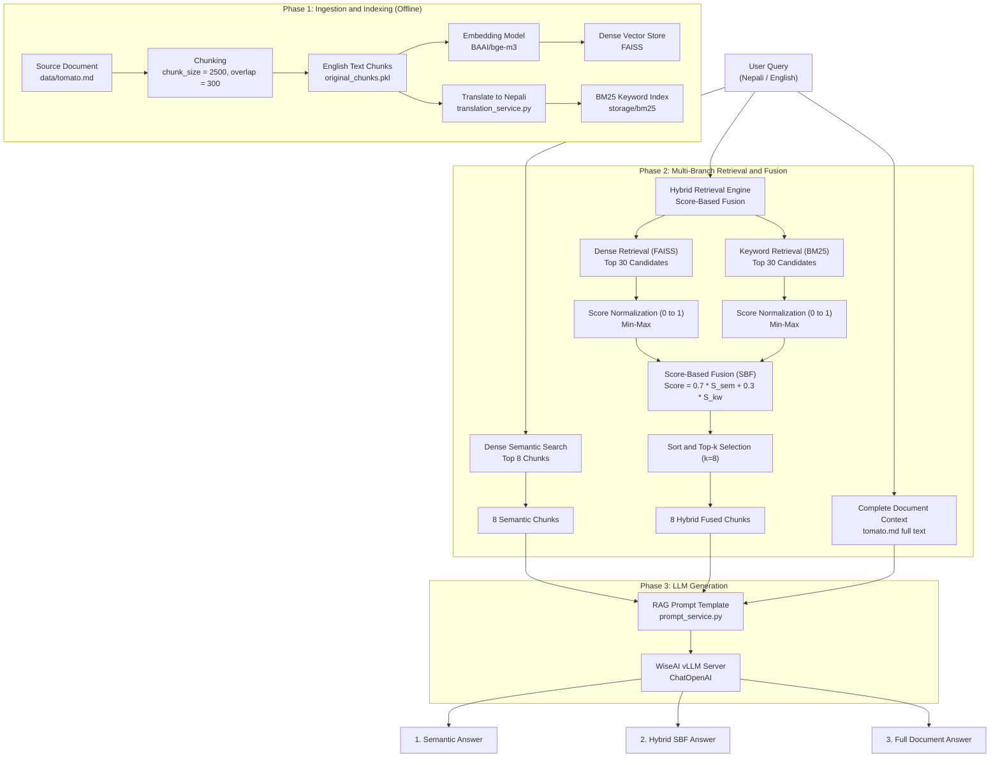
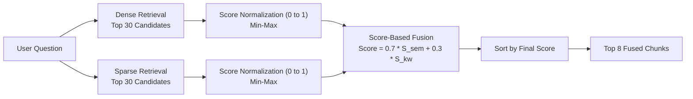

# System Architecture & Flowchart: Cross-Lingual Hybrid RAG Pipeline

This document details the working architecture and dataflow of the Tomato Cultivation RAG system. It covers offline ingestion, cross-lingual dense/sparse indexing, multi-branch retrieval with Score-Based Fusion (SBF), and LLM generation.

---

## 1. End-to-End Architecture Flowchart

---

## 2. Score-Based Fusion (SBF) Mechanism

---

### Mathematical Formulation:

1. **Min-Max Score Normalization**:
   For any retrieved candidate list with scores $S$:
   $$S_{\text{norm}}(d) = \frac{S(d) - \min(S)}{\max(S) - \min(S)}$$
   *(If $\max(S) == \min(S)$, all nonzero scores normalize to $1.0$)*

2. **Weighted Score-Based Fusion (SBF)**:
   $$\text{FinalScore}(d) = \alpha \cdot S_{\text{sem\_norm}}(d) + (1 - \alpha) \cdot S_{\text{kw\_norm}}(d)$$
   - $\alpha = 0.7$ (70% weight on semantic relevance, 30% on keyword matching).
   - Unretrieved items in either modality receive a score of $0.0$.

---

## 3. Core Architecture Phases

### Phase 1: Ingestion & Cross-Lingual Indexing (`ingestion.py`)
1. **Document Loading**: Source guide (`data/tomato.md`) is ingested.
2. **Chunking**: Chunked with `RecursiveCharacterTextSplitter` using **`chunk_size = 2500`** and `chunk_overlap = 300`.
3. **Dense Vector Store**:
   - Chunks are vectorized using `BAAI/bge-m3` (multilingual embeddings) and stored in the FAISS vector index.
4. **Cross-Lingual Sparse Index (BM25)**:
   - English chunks are translated into Nepali to bridge the vocabulary gap.
   - Tokenized Nepali text is indexed using `BM25Okapi` in `storage/bm25`.

### Phase 2: Multi-Branch Retrieval & Fusion (`retriever_service.py`)
- **Semantic Search**: Fetches top 8 nearest neighbors directly from the dense vector index.
- **Hybrid Search (SBF)**: Fetches 30 semantic + 30 keyword candidates, normalizes both candidate pools into $[0, 1]$, fuses them using $\alpha = 0.7$, and selects the top 8 chunks.
- **Full Context**: Uses complete document text for benchmark comparison.

### Phase 3: LLM Generation (`services/llm_service.py`)
- Uses `create_rag_prompt()` with strict grounding instructions.
- WiseAI vLLM server generates 3 answers:
  1. **Semantic Answer**
  2. **Hybrid SBF Answer**
  3. **Full Document Answer**
